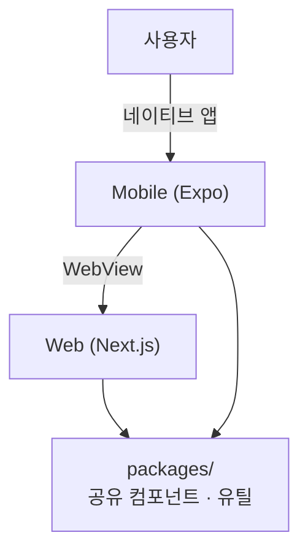

# TinU Client

> 대학생 인증 기반 안전한 교내 중고거래 플랫폼

같은 학교 학생끼리만 거래할 수 있는 인증된 중고거래 서비스입니다.

## 설치 링크

TBD

## 기술 스택

### Web (`apps/web`)

| 분류            | 기술            |
| --------------- | --------------- |
| 프레임워크      | Next.js 15      |
| 언어            | TypeScript      |
| 스타일          | Vanilla Extract |
| 상태 관리       | TanStack Query  |
| 애니메이션      | Framer Motion   |
| HTTP 클라이언트 | ky              |
| 폼              | React Hook Form |

### Mobile (`apps/mobile`)

| 분류       | 기술                    |
| ---------- | ----------------------- |
| 프레임워크 | Expo (React Native)     |
| 언어       | TypeScript              |
| 네비게이션 | React Navigation        |
| 애니메이션 | React Native Reanimated |

### 공통

| 분류          | 기술                 |
| ------------- | -------------------- |
| 모노레포      | Turborepo            |
| 패키지 매니저 | pnpm                 |
| Git 훅        | Lefthook             |
| 커밋 컨벤션   | Conventional Commits |

---

## 아키텍처

### 모노레포 구조

```
tinu-client/
├── apps/
│   ├── web/        # Next.js 웹 앱
│   └── mobile/     # Expo (iOS / Android) 앱
├── packages/       # web ↔ mobile 공유 컴포넌트 및 유틸
├── turbo.json
└── package.json
```

### Hybrid App 구조



웹과 앱이 독립적으로 분리되어 있으며, 모바일 앱은 네이티브 기능이 필요한 페이지는 직접 구현하고, 그 외 페이지는 WebView로 웹을 렌더링해요.

### Hybrid App

1. **iOS Viewport 이슈** — 가상 키보드가 올라올 때 뷰포트가 밀려 고정 헤더가 사라지는 문제가 웹에서 해결이 어려워요. 이를 네이티브에서 직접 처리해 UX를 개선하고자 했어요.
2. **네이티브 기능 필요** — 푸시 알림, 카메라 등 네이티브 API가 필요한 기능은 Expo에서 직접 구현해요.

---

## 시작하기

### 환경 요구사항

| 항목           | 버전                              |
| -------------- | --------------------------------- |
| Node.js        | v20 이상                          |
| pnpm           | v10.6.4                           |
| Xcode          | iOS용 Dev Client 빌드 시 필요     |
| Android Studio | Android용 Dev Client 빌드 시 필요 |

> **Expo Dev Client 방식으로 개발해요.**
> Xcode / Android Studio 없이도 실제 기기에 Dev Client 앱을 설치한 뒤 개발 서버에 연결해 테스트할 수 있어요.
> Dev Client 앱을 처음 설치할 때는 빌드가 필요해요.

### 설치

```bash
# 저장소 클론
git clone https://github.com/TinU-Official/TinU-Client.git
cd TinU-Client

# 의존성 설치
pnpm install
```

### 실행

```bash
# 웹 개발 서버
pnpm dev:web

# 모바일 개발 서버
pnpm dev:mobile

# 전체 동시 실행
pnpm dev
```

---

## 개발 가이드

### 공유 컴포넌트

웹과 모바일에서 공통으로 사용하는 컴포넌트나 유틸은 `packages/` 하위에 위치시켜요.

---

## 배포

TBD

## Made by 👨🏻‍💻

 <div align="center">

|                                                                                  |                                                                                  |
| :----------------------------------------------------------------------------------------------------------------------------------------------------------------------------------------: | :-----------------------------------------------------------------------------------------------------------------------------------------------------------------------------------------: |
| <div align = "center"><b>이정우 🦊</b><a href="https://github.com/jungwoo3490"></div> | <div align = "center"><b>조주희 🌸</b><a href="https://github.com/juheehasaeyo"></div> |
|                                                                                        FE Developer                                                                                        |                                                                                        FE Developer                                                                                         |

</div>
<br/>
